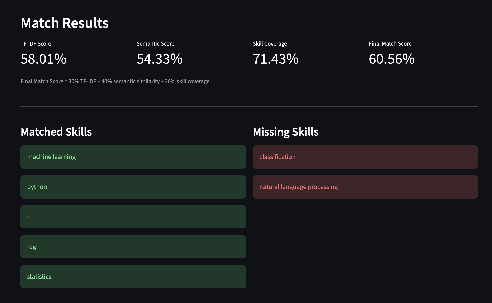
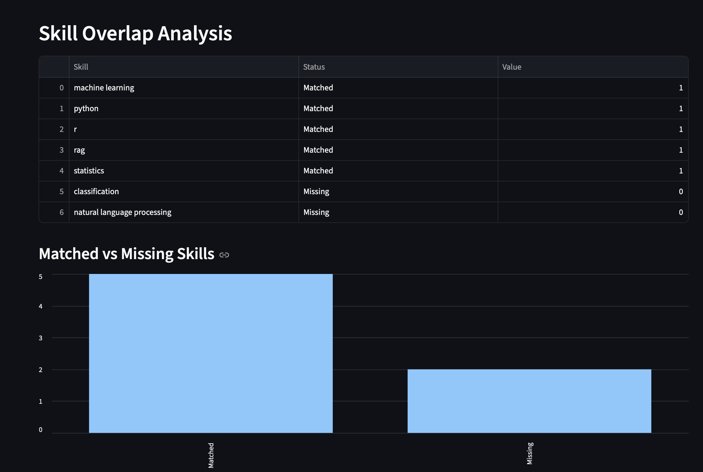
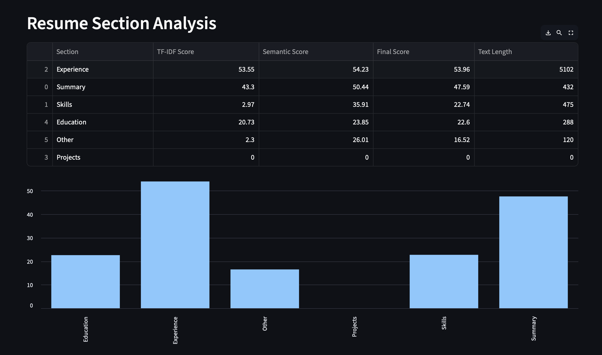
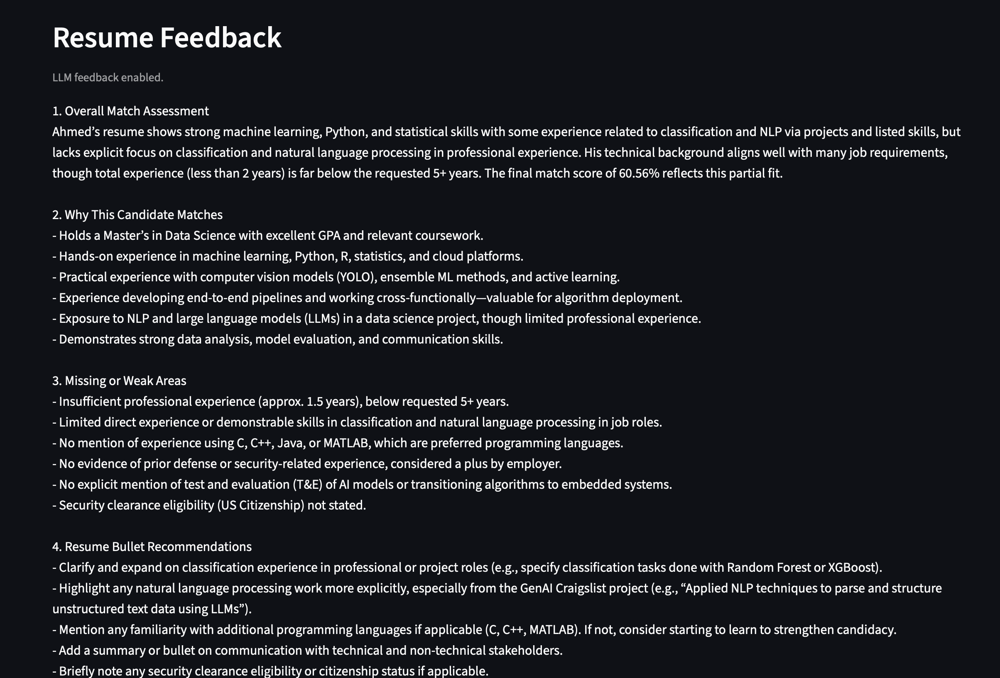

Built JobFit AI 🚀

An NLP application that evaluates resume-job fit using:
• TF-IDF
• Sentence Transformers
• Skill Gap Analysis
• Resume Section Analysis
• Multi-Job Ranking
• Streamlit

The system helps candidates identify missing skills, tailor resumes, and prioritize job opportunities.

Tech Stack:
Python | NLP | Sentence Transformers | Streamlit | Scikit-Learn

# Overview

## Home Screen

## Match Results

## Skill Overlap Analysis

## Resume Section Analysis

## LLM Feedback

